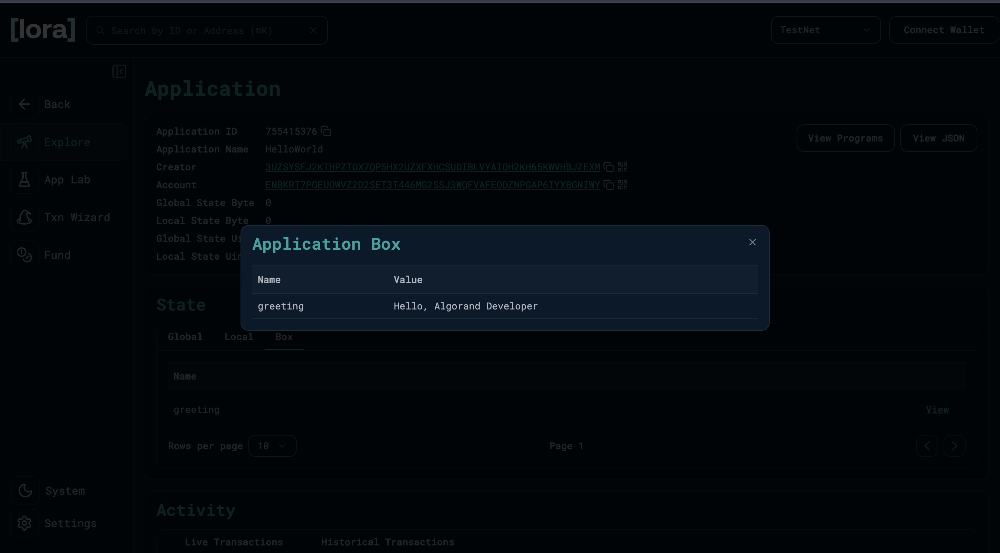

# Blockchain Developer Assessment

Algorand Foundation Developer Relations - Coding Skill Assessment

## Overview

This project demonstrates a modified AlgoKit `HelloWorld` smart contract that:
1. Takes a name as input and concatenates it with `"Hello, "`
2. Stores the concatenated greeting in **box storage** on-chain
3. Returns the greeting to the caller

The contract is written entirely in **Python** using **Algorand Python (Puya)**, deployed to both **Algorand LocalNet** and the public **Algorand Testnet**, and called via a Python deploy script.

## Project Structure

```
algo_dev_environment/
└── projects/blockchain_dev_assessment/
    ├── smart_contracts/
    │   ├── __main__.py                # Build & deploy orchestrator
    │   └── hello_world/
    │       ├── contract.py            # Smart contract (Algorand Python / Puya)
    │       └── deploy_config.py       # Deploy + call script
    ├── tests/
    │   ├── test_hello_world_unit.py          # 5 offline unit tests
    │   └── test_hello_world_integration.py   # 4 integration tests (LocalNet)
    ├── call_hello.py                  # Standalone script for additional transactions
    ├── .env.localnet                  # LocalNet connection config (auto-generated)
    ├── .env.testnet                   # Testnet connection config + deployer mnemonic
    └── pyproject.toml                 # Python project config & dependencies
```

## Smart Contract Changes

### `contract.py`

```python
from algopy import ARC4Contract, Box, String
from algopy.arc4 import abimethod

class HelloWorld(ARC4Contract):
    def __init__(self) -> None:
        self.greeting = Box(String, key=b"greeting")

    @abimethod()
    def hello(self, name: String) -> String:
        greeting = "Hello, " + name
        self.greeting.value = greeting
        return greeting
```

**What changed from the starter template:**
- Added `Box` import from `algopy`
- Added `__init__` constructor that declares a box storage slot with key `"greeting"`
- Modified the `hello` method to store the concatenated phrase `"Hello, <name>"` in box storage before returning it

**Why box storage?**
- Box storage provides up to 32KB per box of on-chain data associated with the contract
- Data persists after the transaction and is publicly readable via block explorers like Lora
- The app account is funded with 1 ALGO to cover the Minimum Balance Requirement (MBR) for box storage

### `deploy_config.py`

**What changed:**
- Changed the `name` parameter from `"world"` to `"John Doe"` (and a second call with `"Algorand Developer"`)
- Added `box_references` to the transaction parameters — this is required by the AVM to declare which boxes the transaction will access

```python
response = app_client.send.hello(
    args=HelloArgs(name=name),
    params=algokit_utils.CommonAppCallParams(
        box_references=[algokit_utils.BoxReference(app_id=0, name=b"greeting")],
    ),
)
```

`app_id=0` means "this contract" and `name=b"greeting"` matches the box key declared in the contract.

## Prerequisites

- [Python 3.12+](https://www.python.org/downloads/)
- [Docker](https://www.docker.com/) (required for LocalNet)
- [pipx](https://pipx.pypa.io/stable/installation/) (for installing CLI tools)
- [AlgoKit CLI](https://github.com/algorandfoundation/algokit-cli#install) v2.0.0+
- [Poetry](https://python-poetry.org/docs/#installation) v1.2+

## Environment & Setup

### 1. Install CLI Tools

```bash
# Install AlgoKit CLI and Poetry via pipx
pipx install algokit
pipx install poetry

# Verify installations
algokit --version    # should show v2.0.0 or later
poetry --version     # should show v1.2 or later
```

### 2. Clone and Enter the Project

```bash
git clone <repo-url>
cd blockchain_dev_assessment/projects/blockchain_dev_assessment
```

### 3. Install Python Dependencies

```bash
poetry install
```

This installs all dependencies into a local `.venv/` virtual environment:
- `algorand-python` — Smart contract framework (Puya)
- `algokit-utils` — Typed client & deployment utilities
- `puyapy` — Compiler (Python to TEAL)
- `algokit-client-generator` — Generates typed Python clients from ARC-56 specs

### 4. Network Environments

This project supports two networks. Each has its own `.env` file that the scripts load automatically based on the `--network` flag.

#### LocalNet (`.env.localnet`)

LocalNet runs a private Algorand network inside Docker containers (algod, indexer, conduit). **No mnemonic is needed** — accounts are auto-created and funded via KMD.

```bash
# Start LocalNet
algokit localnet start
algokit localnet status   # verify it's running

# Generate the env file (one-time)
algokit generate env-file -a target_network localnet
```

The generated `.env.localnet` contains:
```
ALGOD_TOKEN=aaaaaaaaaaaaaaaaaaaaaaaaaaaaaaaaaaaaaaaaaaaaaaaaaaaaaaaaaaaaaaaa
ALGOD_SERVER=http://localhost
ALGOD_PORT=4001
INDEXER_TOKEN=aaaaaaaaaaaaaaaaaaaaaaaaaaaaaaaaaaaaaaaaaaaaaaaaaaaaaaaaaaaaaaaa
INDEXER_SERVER=http://localhost
INDEXER_PORT=8980
```

> No `DEPLOYER_MNEMONIC` is needed for LocalNet. When the SDK detects LocalNet, it automatically creates a wallet via KMD and funds it from the LocalNet dispenser.

#### Testnet (`.env.testnet`)

Testnet is the public Algorand test network. You need a funded account with a mnemonic.

```bash
# Generate the env file (one-time)
algokit generate env-file -a target_network testnet
```

Then edit `.env.testnet` to add your mnemonic (values **must be quoted** if they contain spaces):
```
ALGOD_SERVER=https://testnet-api.algonode.cloud
INDEXER_SERVER=https://testnet-idx.algonode.cloud
DEPLOYER_MNEMONIC="your twenty five word mnemonic here"
```

Fund your account with free testnet ALGO at the [Algorand Testnet Dispenser](https://bank.testnet.algorand.network).

> **Important:** Always quote the `DEPLOYER_MNEMONIC` value in `.env.testnet`. Without quotes, `source .env.testnet` will fail because the shell interprets each word as a separate command.

#### How the Scripts Pick the Right Network

- `call_hello.py` uses the `--network` flag (defaults to `localnet`). It **clears stale env vars** before loading the chosen `.env.<network>` file, so you can safely switch between networks without leftover variables causing issues.
- `smart_contracts deploy` uses whichever env file `python-dotenv` finds (`.env`, `.env.localnet`). For testnet, source the env file first: `set -a && source .env.testnet && set +a`.

### 5. Build the Contract

```bash
# Compile contract + generate typed client
poetry run python -m smart_contracts build
```

### 6. Deploy

#### Deploy to LocalNet

Requires LocalNet running (`algokit localnet start`).

```bash
poetry run python -m smart_contracts deploy
```

Or build and deploy in one step:
```bash
poetry run python -m smart_contracts all
```

Expected output:
```
INFO: Deploying app hello_world
INFO: Called hello on HelloWorld (1002) with name=John Doe, received: Hello, John Doe
INFO: Called hello on HelloWorld (1002) with name=Algorand Developer, received: Hello, Algorand Developer
```

#### Deploy to Testnet

Requires a configured and funded `.env.testnet` (see step 4 above).

```bash
# Load testnet env vars into the shell, then deploy
set -a && source .env.testnet && set +a
poetry run python -m smart_contracts deploy
```

Expected output:
```
INFO: Deploying app hello_world
INFO: Called hello on HelloWorld (755415376) with name=John Doe, received: Hello, John Doe
INFO: Called hello on HelloWorld (755415376) with name=Algorand Developer, received: Hello, Algorand Developer
```

## Making Additional Transactions

Use the standalone `call_hello.py` script to call the contract without re-deploying. The `--network` flag controls which network and env file is used:

```bash
# --- LocalNet (default) ---
# Loads .env.localnet → uses KMD auto-funded account → connects to localhost:4001
poetry run python call_hello.py                          # default name "John Doe"
poetry run python call_hello.py "Alice"                  # custom name

# --- Testnet ---
# Loads .env.testnet → uses DEPLOYER_MNEMONIC → connects to testnet-api.algonode.cloud
poetry run python call_hello.py --network testnet        # default name "John Doe"
poetry run python call_hello.py --network testnet "Bob"  # custom name
```

Each run creates a new on-chain app call transaction and updates the box `greeting` with `"Hello, <name>"`.

> **No need to manually `source` env files.** The script clears stale env vars and loads the correct `.env.<network>` file automatically, so switching between localnet and testnet is safe even in the same terminal session.

## Testing

The project includes both unit tests and integration tests.

### Unit Tests (offline, no network required)

Uses the [`algorand-python-testing`](https://github.com/algorandfoundation/algorand-python-testing) library to test contract logic offline by emulating AVM behavior in pure Python.

| Test | What it verifies |
|---|---|
| `test_hello_returns_greeting` | `hello("John Doe")` returns `"Hello, John Doe"` |
| `test_hello_stores_greeting_in_box` | Box `greeting` exists and contains the value |
| `test_hello_overwrites_box_on_second_call` | Second call replaces the box value |
| `test_hello_with_empty_name` | Edge case: empty name |
| `test_hello_with_long_name` | Longer names work correctly |

### Integration Tests (against LocalNet)

Deploys and calls the contract on a real Algorand LocalNet, then reads box storage directly from `algod` to verify on-chain state.

| Test | What it verifies |
|---|---|
| `test_hello_returns_correct_greeting` | ABI return value on-chain |
| `test_box_storage_contains_greeting` | Reads box from algod, decodes and checks value |
| `test_box_is_overwritten_on_second_call` | Second call overwrites on-chain box |
| `test_app_has_box_listed` | App's box list includes `"greeting"` |

### Running Tests

```bash
# Run all 9 tests
poetry run python -m pytest tests/ -v

# Unit tests only (no network needed)
poetry run python -m pytest tests/test_hello_world_unit.py -v

# Integration tests only (requires LocalNet running)
poetry run python -m pytest tests/test_hello_world_integration.py -v
```

## Lora Block Explorer (LocalNet)

Launch Lora to inspect transactions and box storage on LocalNet:

```bash
algokit localnet explore
```

### App Call Transaction


### Box Storage Data



## Testnet Deployment

The contract has also been deployed to the public **Algorand Testnet**.

| Detail | Value |
|---|---|
| **App ID** | `755415376` |
| **Network** | Algorand Testnet |
| **Creator** | `3UZSYSFJ2KTHPZTOX7QP5HX2UZXFXHCSUDIBLVYAIOH2KH65KWVHBJZEXM` |
| **Box "greeting"** | `Hello, Algorand Developer` |

### Lora Testnet Links

- [View Application on Lora](https://lora.algokit.io/testnet/application/755415376)
- [View Transactions on Lora](https://lora.algokit.io/testnet/application/755415376/transactions)

### Verifying Transactions on Lora

After making a transaction on either network, inspect it on [Lora](https://lora.algokit.io/):

| What | LocalNet | Testnet |
|---|---|---|
| **Launch explorer** | `algokit localnet explore` | Visit [lora.algokit.io/testnet](https://lora.algokit.io/testnet) |
| **View app** | Search by App ID in Lora | [Application 755415376](https://lora.algokit.io/testnet/application/755415376) |
| **View transactions** | App page → "Transactions" tab | [Transactions](https://lora.algokit.io/testnet/application/755415376/transactions) |
| **View box storage** | App page → "Boxes" tab | App page → "Boxes" tab |

### How Transactions Work Under the Hood

Each transaction (LocalNet or Testnet) follows this flow:

1. **Connect** — `AlgorandClient.from_environment()` reads `ALGOD_SERVER` from the loaded env file and connects to the appropriate node
2. **Load account** — On **testnet**, `account.from_environment("DEPLOYER")` reads `DEPLOYER_MNEMONIC` and derives the signing key. On **localnet**, it auto-creates a funded wallet via KMD (no mnemonic needed)
3. **Find app** — `factory.deploy()` looks up the existing app by name and creator, returning an app client
4. **Build transaction** — `app_client.send.hello()` constructs an ABI-encoded app call transaction with `box_references` declaring which boxes will be accessed
5. **Sign & submit** — The transaction is signed with the deployer's private key and submitted to the node
6. **Wait for confirmation** — The SDK waits for the transaction to be confirmed in a block (~4.5s on LocalNet, ~3.3s on Testnet)
7. **Return result** — The ABI return value (`"Hello, <name>"`) is decoded and returned

> **Note:** Every app call transaction that accesses box storage must include `box_references` in its parameters. This is an AVM requirement — the runtime needs to know which boxes a transaction will read or write before execution.

## Tools Used

- [Algorand](https://www.algorand.com/) - Layer 1 Blockchain; [Developer portal](https://dev.algorand.co/)
- [Algorand Python (Puya)](https://github.com/algorandfoundation/puya) - Smart contract language for the AVM
- [AlgoKit CLI](https://github.com/algorandfoundation/algokit-cli) - Project scaffolding, build, deploy; [docs](https://github.com/algorandfoundation/algokit-cli/blob/main/docs/algokit.md)
- [AlgoKit Utils (Python)](https://github.com/algorandfoundation/algokit-utils-py) - Typed client & deployment utilities
- [algorand-python-testing](https://github.com/algorandfoundation/algorand-python-testing) - Offline unit testing for Algorand Python contracts
- [Poetry](https://python-poetry.org/) - Python dependency management
- [Lora](https://lora.algokit.io/) - Block explorer for viewing transactions and storage
- [VS Code](https://code.visualstudio.com/) - Configured with debugging and extensions; see [.vscode](./.vscode) folder
