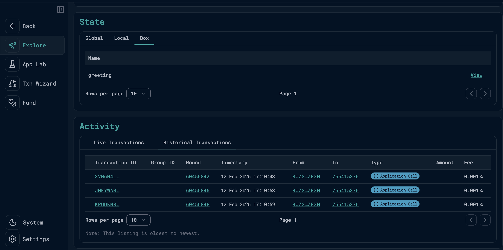
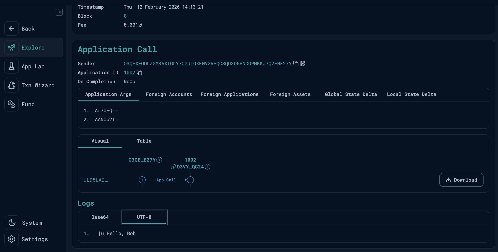

# Blockchain Developer Assessment

Algorand Foundation Developer Relations - Coding Skill Assessment

## Overview

This project demonstrates a modified AlgoKit `HelloWorld` smart contract that:
1. Takes a name as input and concatenates it with `"Hello, "`
2. Stores the concatenated greeting in **box storage** on-chain
3. Returns the greeting to the caller

The contract is deployed to both **Algorand LocalNet** and the public **Algorand Testnet**, and called via a Python deploy script.

## Project Structure

```
blockchain_dev_assessment/
└── projects/blockchain_dev_assessment/
    ├── smart_contracts/
    │   └── hello_world/
    │       ├── contract.py        # Smart contract (Algorand Python / Puya)
    │       └── deploy_config.py   # Deploy + call script
    └── call_hello.py              # Standalone script for making additional transactions
```

## Smart Contract Changes

### `contract.py`

```python
from algopy import ARC4Contract, Box, String
from algopy.arc4 import abimethod

class HelloWorld(ARC4Contract):
    def __init__(self) -> None:
        self.greeting = Box(String, key=b"greeting")

    @abimethod()
    def hello(self, name: String) -> String:
        greeting = "Hello, " + name
        self.greeting.value = greeting
        return greeting
```

**What changed from the starter template:**
- Added `Box` import from `algopy`
- Added `__init__` constructor that declares a box storage slot with key `"greeting"`
- Modified the `hello` method to store the concatenated phrase `"Hello, <name>"` in box storage before returning it

**Why box storage?**
- Box storage provides up to 32KB per box of on-chain data associated with the contract
- Data persists after the transaction and is publicly readable via block explorers like Lora
- The app account is funded with 1 ALGO to cover the Minimum Balance Requirement (MBR) for box storage

### `deploy_config.py`

**What changed:**
- Changed the `name` parameter from `"world"` to `"John Doe"` (and a second call with `"Algorand Developer"`)
- Added `box_references` to the transaction parameters — this is required by the AVM to declare which boxes the transaction will access

```python
response = app_client.send.hello(
    args=HelloArgs(name=name),
    params=algokit_utils.CommonAppCallParams(
        box_references=[algokit_utils.BoxReference(app_id=0, name=b"greeting")],
    ),
)
```

`app_id=0` means "this contract" and `name=b"greeting"` matches the box key declared in the contract.

## Prerequisites

- [Python 3.12+](https://www.python.org/downloads/)
- [Docker](https://www.docker.com/) (required for LocalNet)
- [pipx](https://pipx.pypa.io/stable/installation/) (for installing CLI tools)
- [AlgoKit CLI](https://github.com/algorandfoundation/algokit-cli#install) v2.0.0+
- [Poetry](https://python-poetry.org/docs/#installation) v1.2+

## Environment & Setup

### 1. Install CLI Tools

```bash
# Install AlgoKit CLI and Poetry via pipx
pipx install algokit
pipx install poetry

# Verify installations
algokit --version    # should show v2.0.0 or later
poetry --version     # should show v1.2 or later
```

### 2. Clone and Enter the Project

```bash
git clone <repo-url>
cd blockchain_dev_assessment/projects/blockchain_dev_assessment
```

### 3. Start Algorand LocalNet

LocalNet runs a private Algorand network inside Docker containers (algod, indexer, conduit).

```bash
algokit localnet start
algokit localnet status   # verify it's running
```

### 4. Generate the LocalNet Environment File

This creates a `.env.localnet` file with the algod/indexer connection details for LocalNet.

```bash
algokit generate env-file -a target_network localnet
```

The generated `.env.localnet` contains:
```
ALGOD_TOKEN=aaaaaaaaaaaaaaaaaaaaaaaaaaaaaaaaaaaaaaaaaaaaaaaaaaaaaaaaaaaaaaaa
ALGOD_SERVER=http://localhost
ALGOD_PORT=4001
INDEXER_TOKEN=aaaaaaaaaaaaaaaaaaaaaaaaaaaaaaaaaaaaaaaaaaaaaaaaaaaaaaaaaaaaaaaa
INDEXER_SERVER=http://localhost
INDEXER_PORT=8980
```

> The deploy script auto-loads this via `python-dotenv`. No manual edits needed for LocalNet.

### 5. Install Python Dependencies

```bash
poetry install
```

This installs all dependencies into a local `.venv/` virtual environment:
- `algorand-python` — Smart contract framework (Puya)
- `algokit-utils` — Typed client & deployment utilities
- `puyapy` — Compiler (Python → TEAL)
- `algokit-client-generator` — Generates typed Python clients from ARC-56 specs

### 6. Build and Deploy

```bash
# Build (compile contract + generate typed client) AND deploy in one step
poetry run python -m smart_contracts all
```

Expected output:
```
INFO: Deploying app hello_world
INFO: Called hello on HelloWorld (1002) with name=John Doe, received: Hello, John Doe
INFO: Called hello on HelloWorld (1002) with name=Algorand Developer, received: Hello, Algorand Developer
```

You can also build and deploy separately:
```bash
poetry run python -m smart_contracts build    # compile only
poetry run python -m smart_contracts deploy   # deploy only (requires prior build)
```

## Making Additional Transactions

Use the standalone `call_hello.py` script to call the contract without re-deploying:

```bash
# Default name ("John Doe")
poetry run python call_hello.py

# Pass any name as an argument
poetry run python call_hello.py "Alice"
poetry run python call_hello.py "Bob"
```

Each run creates a new on-chain app call transaction and updates the box `greeting` with `"Hello, <name>"`.

## Lora Block Explorer

Launch Lora to inspect transactions and box storage:

```bash
algokit localnet explore
```

### App Call Transaction



### Box Storage Data



## Testnet Deployment

The contract has also been deployed to the public **Algorand Testnet**.

| Detail | Value |
|---|---|
| **App ID** | `755415376` |
| **Network** | Algorand Testnet |
| **Creator** | `3UZSYSFJ2KTHPZTOX7QP5HX2UZXFXHCSUDIBLVYAIOH2KH65KWVHBJZEXM` |
| **Box "greeting"** | `Hello, Algorand Developer` |

### Lora Testnet Links

- [View Application on Lora](https://lora.algokit.io/testnet/application/755415376)
- [View Transactions on Lora](https://lora.algokit.io/testnet/application/755415376/transactions)

### Deploying to Testnet yourself

```bash
# 1. Generate testnet env file
algokit generate env-file -a target_network testnet

# 2. Add your DEPLOYER_MNEMONIC to .env.testnet

# 3. Fund your account at https://bank.testnet.algorand.network

# 4. Deploy
ALGOD_SERVER=https://testnet-api.algonode.cloud \
DEPLOYER_MNEMONIC="your mnemonic here" \
poetry run python -m smart_contracts deploy
```

## Tools Used

- [Algorand](https://www.algorand.com/) - Layer 1 Blockchain
- [Algorand Python (Puya)](https://github.com/algorandfoundation/puya) - Smart contract language
- [AlgoKit CLI](https://github.com/algorandfoundation/algokit-cli) - Project scaffolding, build, deploy
- [AlgoKit Utils (Python)](https://github.com/algorandfoundation/algokit-utils-py) - Typed client & deployment utilities
- [Poetry](https://python-poetry.org/) - Python dependency management
- [Lora](https://lora.algokit.io/) - Block explorer for viewing transactions and storage
